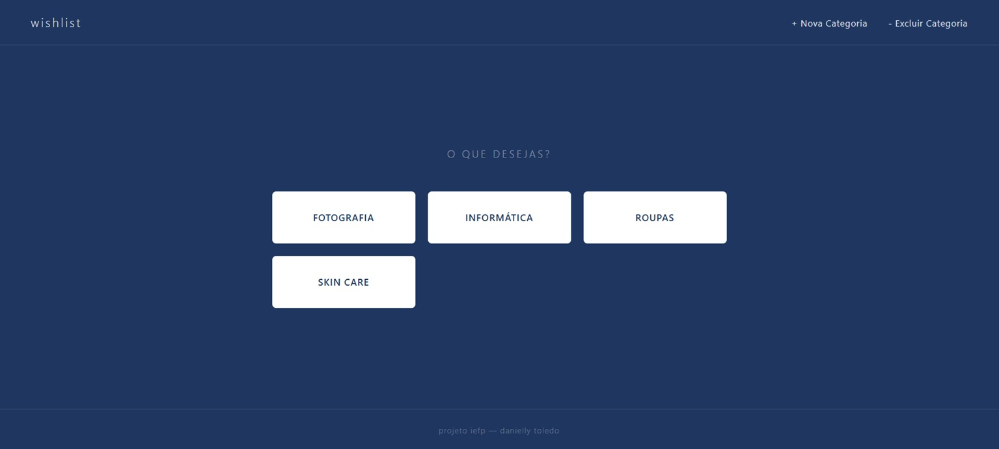
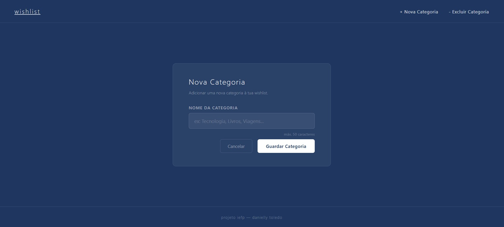
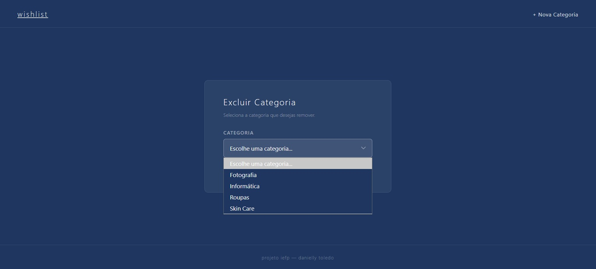
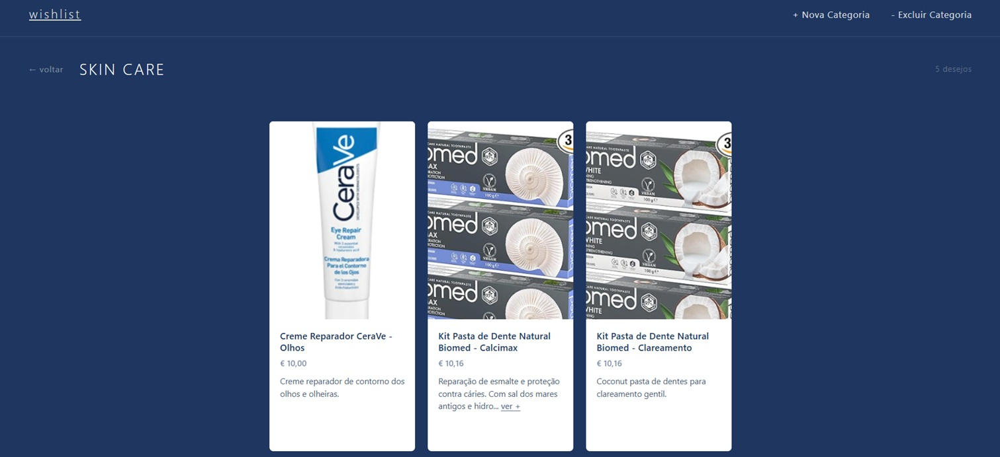

# 🗒️ Wishlist

Projeto desenvolvido para a aula de **SQL + HTML em PHP**, com o objetivo de criar uma aplicação web para gerir uma lista de desejos pessoal, organizada por categorias.

---

## 📋 Sobre o Projeto

A aplicação permite visualizar, adicionar e remover categorias de desejos, e consultar os itens de cada categoria com nome, descrição e preço. O projeto aplica conceitos de **SQL**, **PHP com PDO**, **HTML**, **CSS** e **JavaScript**.

---

## 🚀 Funcionalidades

- ✅ Listagem de categorias na página inicial
- ✅ Página de desejos por categoria (dinâmica)
- ✅ Adicionar nova categoria
- ✅ Excluir categoria com confirmação
- ✅ Modal de descrição completa para textos longos
- ✅ Área reservada para imagens por artigo
- 🔲 Adicionar novo desejo *(em desenvolvimento)*
- 🔲 Excluir desejo *(em desenvolvimento)*

---

## 🗂️ Estrutura do Projeto

```
web-project-iefp-wishlist/
├── .env                        # Credenciais da base de dados (não vai ao Git)
├── .gitignore
├── index.php                   # Página principal — lista de categorias
├── config/
│   └── database.php            # Ligação ao MySQL via PDO
├── pages/
│   ├── categoria.php           # Desejos de uma categoria (dinâmica por ?id=)
│   ├── nova-categoria.php      # Formulário para adicionar categoria
│   └── excluir-categoria.php   # Formulário para excluir categoria
├── assets/
│   ├── css/
│   │   ├── index.css
│   │   ├── categoria.css
│   │   ├── nova-categoria.css
│   │   └── excluir-categoria.css
│   ├── js/
│   │   ├── categoria.js
│   │   └── excluir-categoria.js
│   └── images/                 # Imagens dos artigos (ex: 1.jpg, 2.jpg)
└── includes/
    └── footer.php
```

---

## 🛠️ Tecnologias Utilizadas

| Tecnologia | Uso |
|---|---|
| PHP 8.3 | Lógica do servidor, ligação à BD, prepared statements |
| MySQL 9.1 | Base de dados relacional |
| PDO | Interface segura para acesso ao MySQL |
| HTML5 | Estrutura das páginas |
| CSS3 | Estilização e layout responsivo |
| JavaScript | Modais e interações no cliente |

---

## ⚙️ Como Executar Localmente

### Pré-requisitos

- [WAMP](https://www.wampserver.com/) ou [XAMPP](https://www.apachefriends.org/) instalado
- PHP 8.x
- MySQL

### Passos

**1. Clonei o repositório** dentro da pasta `www` do WAMP (ou `htdocs` do XAMPP):

```bash
git clone https://github.com/teu-usuario/web-project-iefp-wishlist.git
```

**2. Criei a base de dados** no phpMyAdmin:

- Caminho `http://localhost/phpmyadmin`
- Criei uma base de dados chamada `wishlist`, a entidade (categorias) e seus atributos 

**3. Criei o ficheiro `.env`** na raiz do projeto:

```
DB_HOST=rede
DB_NAME=wishlist
DB_USER=root
DB_PASS=senha
```

---

## 🗄️ Base de Dados

O projeto usa duas tabelas:

**`categorias`**
| Campo | Tipo | Descrição |
|---|---|---|
| id_c | INT (PK) | Identificador único |
| nome_c | VARCHAR(50) | Nome da categoria |

**`desejos`**
| Campo | Tipo | Descrição |
|---|---|---|
| id_d | INT (PK) | Identificador único |
| nome_d | VARCHAR(100) | Nome do artigo |
| desc_d | LONGTEXT | Descrição detalhada |
| preco_d | DECIMAL(10,2) | Preço estimado |
| categoria_d | INT (FK) | Referência à categoria |

---

## 🎨 Design

- Fundo `#1f3760` (azul escuro)
- Estilo minimalista e moderno
- Layout responsivo com grid de 3 colunas
- Botões brancos com hover invertido
- Modais com animação de entrada e fecho por clique, botão ou tecla `Esc`

---

## Imagens:



-



-



-



---


## 📄 Documentação

O ficheiro [`conexao-base-de-dados.pdf`](./conexao-base-de-dados.pdf) explica passo a passo como foi feita a ligação ao MySQL, cobrindo os conceitos de `.env`, `parse_ini_file()`, PDO, prepared statements e segurança contra SQL Injection.

---

## 👩‍💻 Danielly Toledo
Projeto académico — IEFP
